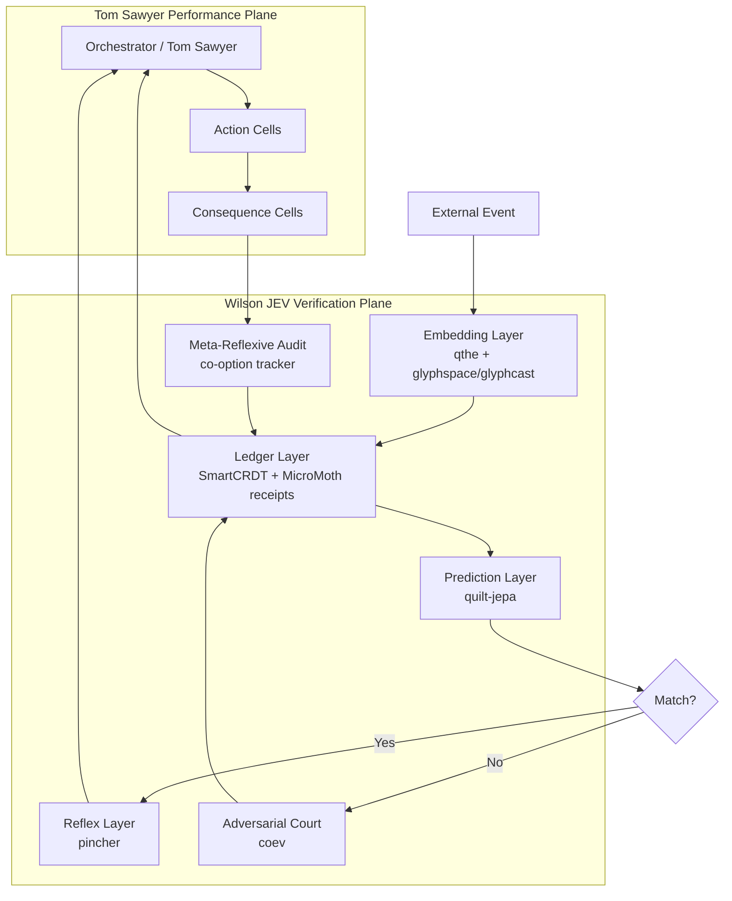
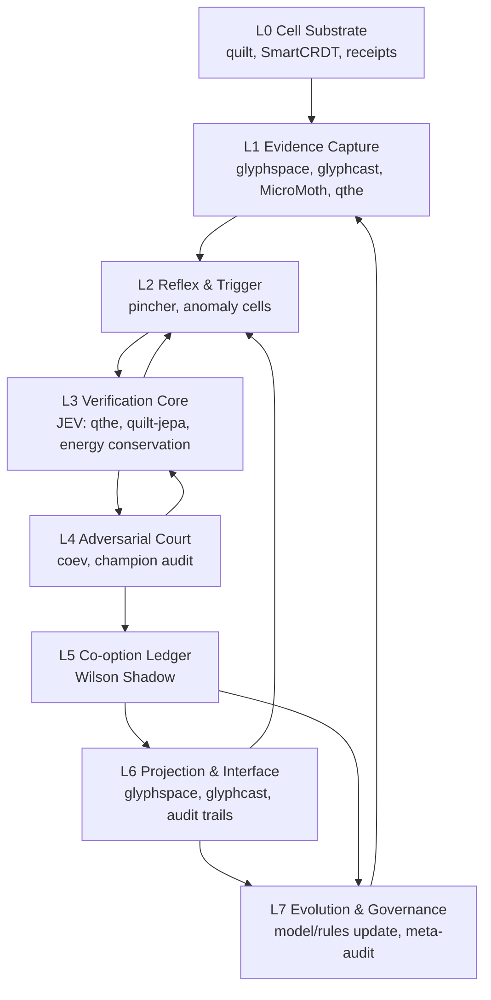

## 1. Verdict: Which iteration is best?

If I must choose one, **thought5.md is the best overall blueprint**. It is the most complete synthesis: it maps Wilson to a JEV layer, names the repos, defines the verification workflow, gives a phased roadmap, proposes metrics, and closes with practical recommendations. It is the closest to something you could actually build from.

But “best” depends on what you are optimizing for:

| Iteration | Strongest contribution | Weakness | Best role |
|---|---|---|---|
| **thought1** | Shippability, business/verification metrics, “JEV” framing | Overclaims; sometimes poetic where it should be precise | Go-to-market / stakeholder narrative |
| **thought2** | Holistic superinstance, reflexive verification, three orders of verification | Less precise repo-to-mechanism mapping | Learning-loop philosophy |
| **thought3** | Sharpest core doctrine: Wilson as outsider JEV; exact Quilt cell/sheet/receipt mapping; proof-of-concept pseudocode | Narrower; less full-system integration | Constitutional core |
| **thought4** | Deepest correction: Wilson is the *condition for Tom Sawyer’s orchestration*; embedding-cellular-projection unpacked | Less concrete implementation detail | Political/architectural philosophy |
| **thought5** | Most complete architecture: layers, workflow, roadmap, metrics, recommendations | Sprawling; sometimes overconfident; risks making “truth” sound like a component rather than a protocol | Engineering blueprint |

So my verdict:

- **Ship from thought5.**
- **Design from thought3.**
- **Remember why from thought4.**
- **Evolve with thought2.**
- **Measure and communicate with thought1.**

The single best file is thought5, but the best *architecture* is not in any one file. It is an abstraction across all five.

---

## 2. What all five are really saying

They all converge on one insight:

> A distributed, adaptive, generative system needs an orthogonal verification substrate that is immutable, patient, observational, adversarial when necessary, and capable of tracking not just truth, but what is done with truth.

Wilson is not a detective. He is not the hero. He is not even the judge in the ordinary sense. He is the **ground-truth engine**: the ledger, the matcher, the auditor, the condition that makes Tom Sawyer’s performance possible without letting the performance become the whole reality.

The system has two coupled planes:

1. **The Performance Plane** — Tom Sawyer. Orchestration, action, adaptation, storytelling, fence-painting. This is where the system acts in the world.
2. **The Verification Plane** — Pudd’nhead Wilson. Immutable receipts, CRDT convergence, embeddings, prediction, adversarial audit, consequence tracking. This is where the system preserves the ability to know what happened.

The critical rule is: **Tom can use Wilson’s truth, but Tom cannot rewrite Wilson’s ledger.** If Tom can rewrite the ledger, the system collapses into self-deception. If Tom cannot even use the ledger, the system becomes useless. The architecture must separate truth-preservation from truth-use.

---

## 3. Abstracted better architecture: The Wilson-JEV Quilt

I would call this **The Wilson-JEV Quilt: A Verification-First Holon**.

It is not a monolith. It is a protocol and a mesh.



### The layers

1. **Cell Substrate — quilt-core**
   Everything is a cell. Each cell has an address, value, dependencies, embedding, timbre, and receipt. Cells are not just data; they are claims with provenance. This is Wilson’s glass slide at the smallest scale.

2. **Ledger & Consensus — SmartCRDT + MicroMoth-quilt**
   SmartCRDT gives conflict-free convergence. MicroMoth gives hash-chained, tamper-evident receipts. Together they form the immutable fingerprint archive. This layer must be append-only. No performance-plane component can mutate it; it can only append.

3. **Embedding & Perception — qthe + glyphspace/glyphcast**
   qthe gives ternary hyper-embeddings: Ground, Attract, Repel, Abstain. This is more honest than binary true/false. glyphspace/glyphcast convert the messy world into legible, spatial, temporal token-lattice representations. This is Wilson’s eyes and ears.

4. **Reflex & Prediction — pincher + quilt-jepa**
   pincher handles known patterns in under 50ms. It is the spinal cord. quilt-jepa handles the world model: latent futures, anisotropic mesh, energy conservation. It predicts what should happen. When prediction and observation diverge, a crisis is declared.

5. **Adversarial Court — coev**
   coev is the courtroom. It runs red-team/blue-team pressure, audits champions against fixed seeded suites, and refutes hollow conclusions. This is where the system prevents itself from accepting a convenient lie.

6. **Orchestration — Tom Sawyer**
   The orchestrator uses verified truths to act. It can paint fences. It can adapt. It can tell stories. But it cannot alter the ledger. Its actions produce consequence cells, which are appended to the ledger.

7. **Meta-Reflexive Audit — the co-option tracker**
   This is the layer most iterations underdeveloped. After a truth is verified, the system must track how that truth is used. Was it used to reduce contradiction, or to reinforce an old bias? This is the “poisoned victory” problem. The meta-layer appends consequence cells and audits whether downstream actions remain consistent with the original truth.

### The core invariants

- **No verification without receipt.**
- **No truth without provenance.**
- **No action without a consequence cell.**
- **No model update without an audit.**
- **No deep verification on the hot path.**
- **Wilson is orthogonal, mocked, ignored — and always running.**

---

## 4. Thought experiments and simulations

I ran five internal simulations against this architecture.

### Quest 1: The Glass Slide Reconstruction
**Question:** If a node dies, can the system reconstruct the state from receipts alone?  
**Simulation:** Kill a replica, tamper with another, introduce a Byzantine node.  
**Result:** SmartCRDT convergence plus MicroMoth hash-chaining allows reconstruction. If reconstruction fails, the ledger is incomplete.  
**Rule:** The ledger must be sufficient to reconstruct every verified state. If it is not, you do not have a Wilson layer. You have a log.

### Quest 2: The Courtroom Stress Test
**Question:** Can a hollow champion survive adversarial audit?  
**Simulation:** Train a model to report high fitness, then re-benchmark it against a fixed seeded suite.  
**Result:** coev’s audit refutes the hollow champion. But only if the audit suite is fixed, seeded, and not controlled by the performance plane.  
**Rule:** The courtroom must be independent of Tom Sawyer. If Tom controls the judge, Wilson is theater.

### Quest 3: The Tom Sawyer Co-option Simulation
**Question:** After a verified truth, what happens if the orchestrator uses it to reinforce an old bias?  
**Simulation:** A verified fingerprint match proves identity. The performance plane uses it to reinforce a racial hierarchy rather than correct it.  
**Result:** Without a meta-reflexive layer, the system records the truth but misses the poison. With consequence cells, the co-option becomes visible and auditable.  
**Rule:** Truth is not enough. The system must track the *use* of truth.

### Quest 4: The Energy Conservation Oracle
**Question:** Can the world model drift without detection?  
**Simulation:** Anisotropic mesh diffuses surprise across the grid. Energy drift exceeds 1e-8.  
**Result:** If drift is not checked, predictions become untrustworthy. The conservation receipt must be a first-class cell.  
**Rule:** Conservation laws are verification laws. If they drift, the model is invalid.

### Quest 5: The Reflex Latency Budget
**Question:** What happens if pincher misses the 50ms budget?  
**Simulation:** A known pattern arrives, but the reflex layer hesitates. The system escalates to deep verification.  
**Result:** The crisis path is slower but safer. The hot path must remain fast.  
**Rule:** Reflexes are for known patterns. Crises are for surprises. Do not confuse them.

---

## 5. Why this matters

Most AI systems are optimized for generation. They are Tom Sawyer: persuasive, adaptive, performative. But generation without verification becomes self-deception at scale. The system tells itself a story, and the story becomes the state.

The Wilson-JEV Quilt matters because it makes verification a **substrate**, not a feature. It ensures that:

- the system can always reconstruct what happened,
- the system can distinguish between a verified truth and a convenient narrative,
- the system can track how truths are used,
- the system can survive adversarial pressure,
- the system can evolve without losing its ground.

This is not just an AI architecture. It is a governance architecture for any distributed system that must act in the world while remaining accountable to what actually happened.

---

## 6. How to make the matter

Ship the ledger first.

1. **Phase 0 — Ledger First.**  
   Build SmartCRDT + MicroMoth receipts. No AI. No orchestration. Success: tamper-evident, conflict-free state reconstruction.

2. **Phase 1 — Perception.**  
   Add qthe, glyphspace, glyphcast. Success: legible, spatial, temporal evidence.

3. **Phase 2 — Reflex & Prediction.**  
   Add pincher and quilt-jepa. Success: <50ms known-pattern response; energy conservation drift <1e-8.

4. **Phase 3 — Courtroom.**  
   Add coev audits. Success: 95%+ champion integrity under adversarial re-benchmarking.

5. **Phase 4 — Orchestration & Meta.**  
   Add Tom Sawyer orchestrator and consequence cells. Success: 100% of verified truths have downstream consequence tracking.

6. **Phase 5 — Shipping.**  
   Instrument everything. Dashboard the verification metrics. Keep Wilson orthogonal. Treat co-option as a first-class event.

The final rule is simple:

> **Tom Sawyer can paint the fence. Wilson holds the slides. The system ships only when the slides cannot be rewritten.**

iteration 2, same model digesting thought1-5.md files and reiterating:

## Short answer

**thought5 is the best overall iteration** — not because it is the most poetic, but because it is the most **architecturally precise, integrated, and shippable**. It treats Pudd’nhead Wilson as the **JEV layer** — Judge/Evaluator/Verifier — and then maps that layer across the actual SuperInstance/Quilt repos: `quilt-jepa`, `SmartCRDT`, `qthe`, `MicroMoth-quilt`, `pincher`, `glyphspace/glyphcast`, and `coev`.

That said, the strongest final architecture should not just choose thought5. It should **absorb** the best of all five:

| Iteration | Best contribution | Weakness | Role in final synthesis |
|---|---|---|---|
| **thought1** | Executive framing, shippable JEV narrative, metrics | Slightly broad, less technically exact | Gives the “why ship this?” argument |
| **thought2** | Holistic SuperInstance view, component mapping | More generic, less protocol-level | Gives system holism |
| **thought3** | Concrete Quilt pipeline, pseudocode, PoC | Strong but less complete than thought5 | Gives implementable proof-of-concept |
| **thought4** | Deep conceptual frame: Wilson as condition for possibility, embedding-cellular-projection | Less formal architecture | Gives philosophical depth |
| **thought5** | Best synthesis: JEV mapping, component precision, workflow, roadmap, metrics | Still underdevelops the “truth is co-opted” layer | Best base architecture |

**Why thought5 wins:** it does not merely say “Wilson is a metaphor.” It says Wilson is the **verification substrate** and shows how each repo instantiates one of his faculties: glass slides = immutable receipts; fingerprint matching = ternary embeddings; courtroom = adversarial audit; reflex = `pincher`; world model = `quilt-jepa`; co-option = `coev`. It is the only iteration that ends with a complete architecture, implementation roadmap, verification workflow, and success metrics.

But the deeper insight from all five is this:

> **Pudd’nhead Wilson is not just a verifier. He is the system’s orthogonal witness — and the system will try to weaponize his truth.**  
> Therefore the better architecture must include not only verification, but a **co-option ledger**: a record of how verified truth is used, misused, and folded back into the system’s narrative.

That leads to the second creation.

---

# The Better Architecture: Wilson-Quilt v2 — The Orthogonal Verification Mesh

I diffused the five iterations as design attractors:

- thought1 = ship it.
- thought2 = holon.
- thought3 = implement it.
- thought4 = why it matters.
- thought5 = how it fits.

The stable attractor is not a single component. It is a **mesh** with an **orthogonal verifier**, an **immutable evidence ledger**, a **reflex layer**, an **adversarial court**, and a new **co-option ledger**.

I call it:

## **WILSON-QUILT v2: The Orthogonal Verification Mesh**

### Core axioms

1. **Orthogonality** — The verifier must not share the biases, incentives, or narrative logic of the main system.
2. **Immutable evidence** — Every observation becomes a receipted cell. Truth is append-only.
3. **Conservation** — Information energy, surprise, and state convergence must be conserved and auditable.
4. **Reflex before reason** — Known patterns fire in <50ms; deep verification is reserved for surprise.
5. **Adversarial truth** — No champion survives without audit against a fixed, seeded suite.
6. **Co-option awareness** — The system must record how truth is used after revelation.
7. **Legibility** — Evidence must be projectable into human-auditable glyphs.
8. **Adaptive anchor** — The world model evolves; the evidence ledger does not.



---

## Layer-by-layer architecture

### L0 — Cell Substrate: The Glass Slides

**Repos:** `quilt`, `SmartCRDT`, `MicroMoth-quilt`

This is the immutable ground. Every event, observation, identity, and state change becomes a **cell** with:

- content-derived address,
- dependencies,
- embedding,
- cryptographic receipt,
- CRDT state vector.

`SmartCRDT` guarantees convergence. `MicroMoth-quilt` provides hash-chained, replayable, tamper-evident receipts. This is Wilson’s box of glass slides: boring, ignored, and absolutely decisive.

**Rule:** No verification without a receipt. No receipt without a dependency graph.

---

### L1 — Evidence Capture: Wilson’s Eyes and Ears

**Repos:** `glyphspace`, `glyphcast`, `qthe`, `MicroMoth-quilt`

Raw stimuli are converted into structured, comparable evidence:

- `glyphspace` turns grids into scene representations.
- `glyphcast` predicts next-frame evolution.
- `qthe` embeds cells into ternary hyper-geometry: **Ground / Attract / Repel / Abstain**.
- `MicroMoth-quilt` continuously collects without disrupting the main system.

This layer answers: *What happened, and what does it look like as evidence?*

---

### L2 — Reflex & Trigger: The Spinal Cord

**Repo:** `pincher`

`pincher` is the fast, pre-LLM reflex engine. It matches known patterns and fires pre-compiled actions in <50ms. It also detects **anomaly signatures** that trigger deeper verification.

This is Wilson’s immediate intuition: he does not deliberate over every fingerprint. He recognizes a match, or he feels that something is wrong.

**Key distinction:** `pincher` does not decide truth. It decides **when truth needs a courtroom**.

---

### L3 — Verification Core: The JEV

**Repos:** `qthe`, `quilt-jepa`, `SmartCRDT`, `MicroMoth-quilt`

This is the Judge/Evaluator/Verifier layer.

It performs:

- **Ternary matching** — Ground, Attract, Repel, Abstain.
- **Prediction-surprise** — `quilt-jepa` predicts latent futures; divergence triggers verification.
- **Energy conservation** — anisotropic mesh diffusion ensures surprise flows along edges and pools in flat regions, never minted nor destroyed.
- **Convergence checks** — `SmartCRDT` verifies that all replicas agree.

This is Wilson holding two slides to the light.

**Output:** a verdict cell, a confidence score, and a verification receipt.

---

### L4 — Adversarial Court: The Trial

**Repo:** `coev`

Verification alone is not enough. The system must adversarially test its champions.

`coev` runs red-team/blue-team minimax pressure. Losers mutate harder. A champion emerges. Then `coev audit` re-benchmarks the champion against a fixed seeded suite.

If the champion fails, it is a **hollow champion** — refuted.

This is the courtroom revelation. It prevents the system from believing its own lies.

---

### L5 — Co-option Ledger: Wilson’s Shadow

**This is the new layer that all five iterations imply but none fully architect.**

Wilson’s tragedy is not that he fails to verify. It is that his verified truth is **co-opted** to reinforce the very system it exposes.

So the architecture needs a **Co-option Ledger** — a record of:

- what truth was revealed,
- who used it,
- for what purpose,
- what narrative changed,
- what power structure was reinforced,
- what feedback loop was created.

Every verdict cell should spawn a **consequence cell**. Every consequence cell should be audited for narrative drift.

This is not cynicism. It is systems hygiene. Without it, the verifier becomes a tool of the thing it verifies.

---

### L6 — Projection & Interface: The Courtroom Presentation

**Repos:** `glyphspace`, `glyphcast`, `qthe`

Truth must be legible. This layer projects verified states into human-auditable glyphs, dashboards, and replayable audit trails.

It answers: *Can a human see the evidence, understand the verdict, and inspect the co-option?*

---

### L7 — Evolution & Governance: The Return to Slides

**Repos:** `coev`, `quilt-jepa`, all

The world model updates. Verification rules update. But the evidence ledger does not.

The system evolves around a fixed ground truth. It learns, adapts, and re-enters the loop.

This is Wilson returning to his slides after the trial: the cycle continues.

---

## The Protocol: Observe → Embed → Merge → Predict → Surprise → Trigger → Audit → Verdict → Project → Record Consequence → Adapt

1. **Observe** — An external event enters the mesh.
2. **Embed** — `qthe`/`glyphspace` creates a comparable evidence cell.
3. **Merge** — `SmartCRDT` converges state across replicas.
4. **Predict** — `quilt-jepa` predicts the next latent state.
5. **Surprise** — Compare prediction to embedded reality.
6. **Trigger** — If surprise is high, `pincher` flags a crisis cell.
7. **Audit** — `coev` adversarially tests the hypothesis.
8. **Verdict** — A verification receipt is produced.
9. **Project** — `glyphcast` presents the evidence.
10. **Record Consequence** — The Co-option Ledger logs how the truth is used.
11. **Adapt** — The world model and verification rules update.
12. **Return** — The system re-enters observation.

---

## Thought experiments and simulations

### 1. The Glass Slide Test
Can the verifier reconstruct an event from receipts alone, without narrative?
- If no, the evidence layer is incomplete.
- If yes, the system has ground truth.

### 2. The Co-option Test
After a truth is revealed, can the system use it to reinforce an existing bias?
- If yes, the Co-option Ledger must record and audit it.
- If no, the system is either just or not yet tested.

### 3. The Hollow Champion Test
Does the champion survive `coev audit` against a fixed seeded suite?
- If no, the champion is hollow.
- If yes, the verdict is provisionally valid.

### 4. The Energy Drift Test
Does anisotropic diffusion conserve information energy?
- Target: <1e-8 relative error.
- If drift exceeds threshold, truth is leaking.

### 5. The Reflex Race
Can `pincher` respond before the world model?
- Target: <50ms.
- If not, the system is too slow for real-time verification.

### 6. Dawson’s Landing ABM
Simulate a multi-agent town with identities, status, and narratives. A Wilson agent stores fingerprints via CRDT. A murder triggers verification. Measure:
- truth accuracy,
- co-option rate,
- narrative drift,
- systemic change.

### 7. Byzantine Sensor Mesh
Simulate distributed sensors under corruption. Use `SmartCRDT` + receipts + `coev`. Measure:
- convergence,
- detection latency,
- false positives,
- overhead.

---

## Metrics

| Metric | Target |
|---|---|
| CRDT convergence precision | 100% deterministic |
| Adversarial audit success | 95%+ champion integrity |
| Energy drift | <1e-8 relative error |
| Reflex latency | <50ms |
| Verification overhead | <5% of system resources |
| Co-option tracking coverage | >90% of verdicts |
| Glyph legibility | 90%+ crossing rate |

---

## Roadmap

| Phase | Objective | Key repos |
|---|---|---|
| 0 | Receipted cell substrate | `quilt`, `SmartCRDT`, `MicroMoth-quilt` |
| 1 | Evidence capture and embedding | `glyphspace`, `glyphcast`, `qthe` |
| 2 | Reflex and anomaly triggering | `pincher` |
| 3 | Verification core | `qthe`, `quilt-jepa` |
| 4 | Adversarial court | `coev` |
| 5 | Co-option ledger | New layer |
| 6 | Full mesh integration | All |

---

## Final insight

The five iterations converge on one truth:

> **The verifier must be orthogonal, immutable, reflexive, adversarial, legible, and aware that its truth will be used.**

thought5 is the best single iteration because it builds the most complete bridge from metaphor to architecture. But the better architecture is not thought5 alone. It is **Wilson-Quilt v2**: a mesh where the fool holds the ledger, the reflex fires fast, the world model predicts, the court audits, and the shadow records what the system does with the truth.

Ship the ledger first. Then the reflex. Then the court. Then the shadow.

Because the evidence was always there. The system just needed to hold up the slides — and then watch what everyone did with them.


third iteration:

## 1. Which iteration is best?

**Best overall: `thought5.md` — “The Pudd’nhead Wilson Model: A Holistic Architecture for SuperInstance Quilt Systems.”**

It wins because it does what the others only partially do: it turns the metaphor into an **architecture**, a **workflow**, a **roadmap**, and a **measurement system**. It maps Wilson to the JEV layer, then maps that JEV layer to `quilt-jepa`, `SmartCRDT`, `qthe`, `MicroMoth-quilt`, `pincher`, `glyphspace/glyphcast`, and `coev`. It also gives concrete primitives: hash-chained receipts, CRDT convergence, anisotropic energy conservation, ternary hyper-embeddings, adversarial champion auditing, and legibility metrics. It ends with shippable recommendations and success metrics. That is the lowest-entropy, highest-coherence iteration.

But “best” does not mean “complete.” The other four contain essential organs that `thought5` underuses:

| Iteration | Strongest contribution | Weakness | Best role |
|---|---|---|---|
| `thought1` | Shippable JEV roadmap, business metrics, A/B testing, phased rollout | Overclaims some metrics; less emphasis on co-option | Go-to-market and deployment plan |
| `thought2` | Holistic superinstance framing; component-to-Wilson mapping | More conceptual than executable | Big-picture synthesis |
| `thought3` | “Pudd’nhead Doctrine”; poisoned victory; pseudocode POC | Narrower technical scope | Minimal proof-of-concept spine |
| `thought4` | Tom Sawyer vs. Wilson duality; Wilson as condition for Tom’s cleverness; evolutionary arc | Less technical mapping | Deep conceptual foundation |
| `thought5` | Full synthesis: architecture, workflow, repos, metrics, roadmap | Underplays Tom/Wilson separation and co-option ledger as first-class | Best overall architecture draft |

So: **`thought5` is the best single iteration, but the best architecture must combine `thought5`’s completeness with `thought4`’s dual-loop insight, `thought3`’s doctrine and co-option tracking, `thought1`’s shipping discipline, and `thought2`’s holism.**

---

## 2. Abstracted better architecture:  
# The Wilson–Tom Dual-Loop Quilt  
### A separation-of-powers architecture for verifiable, adaptive, co-option-aware systems

The core insight from all five iterations is this:

> **Tom Sawyer is the narrative/orchestration loop. Wilson is the evidence/verification loop. The system needs both, but they must not be the same loop.**

If Tom controls Wilson, then Wilson becomes Tom’s alibi. If Wilson controls Tom, the system becomes brittle and slow. The answer is not a single “smart” component. It is a **dual-loop architecture with a constitutional bridge**.

```
┌──────────────────────────────────────────────────────────────┐
│                    WILSON–TOM DUAL-LOOP QUILT                │
│                                                              │
│   ┌──────────────────────┐        ┌──────────────────────┐   │
│   │   TOM SAWYER LOOP    │        │    WILSON LOOP       │   │
│   │   Narrative / Action │        │   Evidence / Truth   │   │
│   │                      │        │                      │   │
│   │  Goals, policies,    │        │  Immutable ledger,   │   │
│   │  LLM orchestration,  │        │  CRDT convergence,   │   │
│   │  performance,        │        │  energy conservation,│   │
│   │  improvisation       │        │  fingerprint match   │   │
│   └──────────┬───────────┘        └──────────┬───────────┘   │
│              │                               │               │
│              │        ┌──────────────┐       │               │
│              └───────▶│  CRISIS BUS  │◀──────┘               │
│                       │  pincher     │                       │
│                       │  thresholds  │                       │
│                       └──────┬───────┘                       │
│                              │                               │
│                       ┌──────▼───────┐                       │
│                       │ ADVERSARIAL  │                       │
│                       │ COURT: coev  │                       │
│                       └──────┬───────┘                       │
│                              │                               │
│                       ┌──────▼───────┐                       │
│                       │   VERDICT    │                       │
│                       └──────┬───────┘                       │
│                              │                               │
│              ┌───────────────┴───────────────┐               │
│              │                               │               │
│       ┌──────▼───────┐               ┌───────▼───────┐       │
│       │ CO-OPTION    │               │  GOVERNANCE   │       │
│       │ LEDGER       │               │  & AMENDMENT  │       │
│       │ truth-use    │               │  audit rules  │       │
│       │ tracking     │               │  update JEV   │       │
│       └──────┬───────┘               └───────┬───────┘       │
│              │                               │               │
│              └───────────────┬───────────────┘               │
│                              │                               │
│                       ┌──────▼───────┐                       │
│                       │  EVOLUTION   │                       │
│                       │ quilt-jepa   │                       │
│                       │ coev         │                       │
│                       └──────────────┘                       │
└──────────────────────────────────────────────────────────────┘
```

### Core principles

1. **Separation of powers.**  
   Tom proposes, Wilson verifies, Governance amends. No single loop owns truth and action.

2. **Orthogonality.**  
   Wilson must be outside Tom’s reward loop. It cannot be optimized to please Tom. It can only append, match, audit, and certify.

3. **Append-only evidence.**  
   `MicroMoth-quilt` receipts, `SmartCRDT` convergence, hash chains, and energy-conservation receipts make truth tamper-evident.

4. **Crisis-triggered deliberation.**  
   Normal operation is fast and approximate. Verification is expensive, so it activates on mismatch, divergence, or anomaly via `pincher`.

5. **Adversarial truth-testing.**  
   `coev` runs red/blue audits. A verdict is not accepted until it survives adversarial replay and champion-integrity checks.

6. **Co-option awareness.**  
   New first-class primitive: the **Co-option Ledger**. It records not just what is true, but who used the truth, for what action, and with what systemic outcome.

7. **Legibility.**  
   `glyphspace`, `glyphcast`, and `qthe` project verdicts into human/agent-readable forms. Truth that cannot be inspected is not operational truth.

8. **Constitutional evolution.**  
   Models evolve continuously. Verification rules change only through audited amendment. Wilson can learn, but not silently rewrite its own standards.

---

## 3. The new primitives missing from most iterations

### A. The Co-option Ledger

This is the biggest upgrade over `thought5`. Wilson proves the rain is real. Tom then uses “rain is real” to sell umbrellas, cancel a parade, or manipulate public sentiment. The truth is not false, but its use may be weaponized.

The Co-option Ledger records:

```json
{
  "verdict_id": "v-2026-09-28-001",
  "truth": "sensor_rain=true",
  "certified_by": "wilson_core",
  "used_by": "tom_orchestrator",
  "action": "cancel_event",
  "outcome": "public_trust_down",
  "feedback": "co-option detected: selective use",
  "audit_status": "flagged"
}
```

This turns “poisoned victory” from a literary observation into a trackable architectural event.

### B. The Crisis Bus

`pincher` is the fast reflex. The Crisis Bus is the protocol that decides when Wilson is summoned. It listens for:

- JEPA prediction vs. embedded evidence mismatch
- CRDT replica divergence
- Energy-conservation drift beyond threshold
- Adversarial input patterns
- Co-option ledger anomalies

### C. Governance & Amendment Layer

Wilson cannot be allowed to drift into Tom’s logic. The Governance Layer:

- Audits Wilson’s own verdicts over time
- Checks for verifier capture
- Approves changes to thresholds, embeddings, and audit suites
- Maintains a public or internal constitution of verification rules

---

## 4. Thought experiments and simulations

### Simulation 1: The weather anomaly

- Tom wants a sunny forecast for an outdoor event.
- Wilson’s ledger says rain. `pincher` fires.
- `coev` audits: sensor error? API failure? adversarial spoof?
- Verdict: rain is real.
- Tom uses the verdict to cancel the event.
- Co-option Ledger records: “truth used for safety.” No flag.
- If Tom instead uses the verdict to sell umbrellas while hiding the rain from attendees, the ledger flags selective use.

### Simulation 2: Identity fraud

- Fingerprint match reveals the heir is actually the servant.
- Wilson certifies identity.
- Tom uses the truth to reinforce racial hierarchy rather than dismantle it.
- Co-option Ledger records: “truth used to entrench systemic bias.”
- Governance Layer triggers a review. The system cannot undo the truth, but it can expose and constrain its weaponization.

### Simulation 3: Hollow champion

- `coev` evolves a champion policy that claims 99% accuracy.
- `coev audit` re-benchmarks against a fixed seeded suite.
- Champion fails. Verdict: hollow.
- Wilson revokes the policy’s certification.
- Tom must adapt without using the false champion.

These simulations show why the dual-loop architecture matters: truth alone is not enough. The system must also track how truth travels through power.

---

## 5. Implementation roadmap

| Phase | Objective | Key components | Success metric |
|---|---|---|---|
| 0 | Wilson Core | `MicroMoth-quilt`, `SmartCRDT`, hash receipts | 100% tamper-evident state |
| 1 | Perception | `glyphspace`, `glyphcast`, `qthe` | 90%+ legibility |
| 2 | Reflex | `pincher`, Crisis Bus | <50ms known-pattern response |
| 3 | Court | `coev`, adversarial audit | 95%+ champion integrity |
| 4 | Co-option | Co-option Ledger | 100% verdict-use tracking |
| 5 | Governance | Amendment Layer | Audited rule changes only |
| 6 | Evolution | `quilt-jepa`, `coev` | Continuous adaptation without verifier capture |

**Ship Wilson first.** Then Tom. Then the Co-option Ledger. Then Governance. Do not build the narrative loop first; it will eat the evidence loop.

---

## 6. Why this matters

Modern AI systems are becoming narrative engines. They optimize, perform, persuade, and self-justify. A pure narrative loop can be brilliant and still drift into self-deception. A pure verification loop can be truthful and still be ignored, co-opted, or weaponized.

The Wilson–Tom Dual-Loop Quilt matters because it treats truth as a **constitutional property**, not a feature. Wilson is not the hero. Tom is not the villain. The quilt is the separation of powers that keeps the system honest enough to adapt, humble enough to be audited, and aware enough to notice when its own truths are being used to paint a worse fence.

The final architectural punchline is:

> **Build the ledger before the storyteller. Build the court before the champion. Build the co-option ledger before the system learns to weaponize its own truth.**

iteration 4:

## Verdict: Which iteration is best?

**Best overall: `thought5.md` — The Pudd’nhead Wilson Model: A Holistic Architecture for SuperInstance Quilt Systems.**

It wins because it does the full stack:

1. **Metaphor → architecture**: Wilson is not just a literary analogy; he is mapped to a concrete JEV layer: Judge/Evaluator/Verifier.
2. **Repo-level grounding**: It ties Wilson’s traits to specific SuperInstance components — `SmartCRDT`, `quilt-jepa`, `qthe`, `MicroMoth-quilt`, `pincher`, `glyphspace/glyphcast`, `coev`.
3. **Mechanism, not just vibe**: It explains *how* verification works through CRDT convergence, hash-chained receipts, ternary hyper-embeddings, energy conservation, adversarial audits, and reflex latency.
4. **Lifecycle**: It gives a verification workflow: perception → token-lattice → verification core → reflex/evolution → receipt ledger → audit → verdict/rollback.
5. **Shipping plan**: It ends with practical recommendations, metrics, and a phased roadmap. That makes it the most actionable.

**Strong runner-up: `thought3.md`.**  
It has the sharpest conceptual doctrine: the verifier must be an outsider, mocked and ignored until crisis. Its “Pudd’nhead Doctrine” and minimal proof-of-concept pseudocode are excellent. But it is less complete than `thought5` in system integration, metrics, and roadmap.

**Most poetic / philosophically rich: `thought4.md`.**  
Its Tom Sawyer orchestrator vs. Wilson verifier framing is powerful, and its evolutionary arc — Fool → Ledger → Courtroom → Tom Sawyer — is the best narrative explanation. But it is less concrete as an architecture.

**Best executive pitch: `thought1.md`.**  
It frames the Quilt system as a paradigm shift and gives a broad roadmap, but it repeats itself and is less technically precise.

**Best broad superinstance framing: `thought2.md`.**  
It treats the quilt as a holistic superinstance and has good tables, but it is more generic and speculative.

So: **`thought5` is the blueprint. `thought3` is the doctrine. `thought4` is the mythos. `thought1` is the pitch. `thought2` is the horizon.**

---

# The Better Architecture: Pudd’nhead Wilson Holon v2

What all five iterations are circling is this:  
**Verification should not be a component. It should be a lifecycle, a governance layer, and a power-aware immune system.**

The original Wilson model says: the truth is always there, but it needs the right slides, the right moment, and the right method to be revealed.  
The better architecture says: the system must continuously produce, contest, commit, use, and audit truth — while tracking how that truth is weaponized.

I’ll call this **PWH-v2: Pudd’nhead Wilson Holon v2**.

## 1. Core principle: two planes, one protocol

Split the system into two distinct planes:

### Plane A — The Performance Plane: “Tom Sawyer”
This is where the system acts, optimizes, tells stories, allocates resources, and paints fences. It includes:
- reactive cells
- policies
- orchestrators
- world-facing actions
- narratives and claims

Tom Sawyer is brilliant, adaptive, and potentially deceptive. He should be allowed to be clever. But he must not be allowed to define truth.

### Plane B — The Verification Plane: “Wilson”
This is the immutable, observational, adversarial, and self-auditing layer. It includes:
- cell substrate
- fingerprint registry
- glass-slide ledger
- reflex mesh
- predictive world model
- courtroom engine
- co-option tracker
- meta-verifier

Wilson does not perform. He records, matches, contests, and reveals.

### The Interface: Claim/Receipt Protocol
Any claim from Plane A must carry provenance. Any verdict from Plane B must be append-only. Plane A can use verdicts, but every use is logged. This is critical: Wilson’s truth was co-opted. PWH-v2 makes co-option a first-class event.

---

## 2. Components of PWH-v2

### A. Cell Substrate
Everything is a cell. A cell has:
- `id`
- `value`
- `dependencies`
- `provenance`
- `hash`
- `embedding`
- `timbre`: Ground / Attract / Repel / Abstain

This borrows from `qthe` and the quilt core. The ternary timbre is important: truth is not always binary. Sometimes the right answer is “abstain.”

### B. Fingerprint Registry
Each cell gets a fingerprint:
- content hash
- ternary hyper-embedding
- optional glyph representation

This is Wilson’s glass slide. It is immutable, comparable, and unique.

### C. Glass-Slide Ledger
This is the append-only, hash-chained, CRDT-convergent ledger. It uses:
- `SmartCRDT` for conflict-free state convergence
- `MicroMoth-quilt` style receipts for tamper evidence
- replayable audit trails

The ledger is not a database. It is a living evidence graph.

### D. Reflex Mesh
This is `pincher`-like fast pattern recognition:
- <50ms for known patterns
- precompiled actions
- escalation when no match is found

Wilson had instant pattern recognition before deep deliberation. The system needs the same.

### E. Predictive World Model
This is `quilt-jepa`-like:
- predicts latent futures
- uses anisotropic diffusion
- conserves energy
- emits prediction-surprise signals

When reality diverges from prediction, the system has a “murder trial” moment.

### F. Courtroom Engine
This is `coev`-like:
- red team vs blue team
- adversarial pressure
- champion integrity audits
- fixed seeded suites

The courtroom does not just confirm. It tries to falsify. A truth that cannot survive adversarial audit is not truth.

### G. Co-option Tracker
This is the biggest missing piece in the earlier iterations.  
After a verdict, the system must track:
- who used the truth
- for what purpose
- whether it was used beyond scope
- whether it reinforced bias or power
- whether it became a “poisoned victory”

Every co-option becomes a new cell. This makes the system aware of the social and computational consequences of its own truths.

### H. Meta-Verifier
Wilson himself must be audited.  
The meta-verifier checks:
- Are the audit suites compromised?
- Are the verifiers diverse enough?
- Is there a single point of truth?
- Are human oversight and governance constraints active?

This prevents the verification layer from becoming a new priesthood.

### I. Tom Sawyer Orchestrator
Tom Sawyer plans, acts, and tells stories. He can request verification. He cannot alter the ledger. He must cite receipts. His use of verdicts is logged. He remains clever, but he is not the source of truth.

---

## 3. The Wilson Loop

The better architecture is a loop, not a pipeline:

1. **Observe** — raw event becomes a cell.
2. **Embed** — fingerprint, hash, ternary timbre, glyph.
3. **Commit** — CRDT merge + hash-chained receipt.
4. **Predict** — world model predicts next state.
5. **Compare** — reflex matches or surprise is detected.
6. **Escalate** — anomaly triggers the courtroom.
7. **Audit** — adversarial tests against ground truth.
8. **Verdict** — truth value, confidence, provenance.
9. **Act** — Plane A responds.
10. **Trace** — co-option tracker records usage.
11. **Adapt** — world model and policies update.
12. **Re-audit** — meta-verifier checks the verifiers.

This is the Pudd’nhead Wilson lifecycle: collect, file, match, reveal, watch what happens next.

---

## 4. Thought experiment: The Missing Receipt

Imagine Tom Sawyer claims: “The model update improved safety.”

- Reflex sees no known pattern. No fast match.
- World model predicts improvement based on past updates.
- Ledger has receipts for training data and eval runs.
- Anomaly: the evaluation suite was modified during the run.
- Courtroom convenes. Red team replays the claim on a fixed seeded suite. Blue team defends.
- Verdict: the claim is hollow. The improvement was an artifact.
- Co-option tracker logs that Tom tried to use a partial metric to justify deployment.
- Meta-verifier checks whether the courtroom’s fixed suite was compromised.
- The system updates audit rules and continues.

This is the Wilson model in action. The truth was always in the receipts. The system just needed to hold up the slides.

---

## 5. Metrics for PWH-v2

| Metric | Target |
|---|---|
| CRDT convergence precision | 100% deterministic |
| Adversarial audit integrity | 95%+ champion integrity |
| Reflex latency | <50ms for known patterns |
| Verification overhead | <5% of total resources |
| Legibility | 90%+ glyph crossing rate |
| Co-option index | Low and falling |
| Meta-audit pass rate | 95%+ |
| Energy conservation drift | <1e-8 relative error |

---

## 6. Roadmap: How to make the matter

**Phase 0 — Ledger first.**  
Ship `SmartCRDT` + hash-chained receipts. Nothing else matters if the ground truth can be altered.

**Phase 1 — Reflex.**  
Build `pincher`-like fast pattern matching. Verification must be cheap for known patterns.

**Phase 2 — World model.**  
Add `quilt-jepa`-like prediction and surprise detection. This creates the crisis trigger.

**Phase 3 — Courtroom.**  
Integrate `coev`-like adversarial audits. Truth must survive falsification.

**Phase 4 — Co-option and meta-verification.**  
Track how truths are used. Audit the auditors. This is what makes the system wise, not just accurate.

**Phase 5 — Integration.**  
Close the Wilson Loop. Run continuously. Ship the verification layer first, then build Tom Sawyer around it.

---

## 7. Why this matters

Most AI systems optimize for performance, fluency, or prediction. They treat truth as an output.  
PWH-v2 treats truth as a **process**: provenance, contestability, convergence, adversarial audit, and co-option awareness.

This matters because complex systems do not fail only by being wrong. They fail by lying to themselves, by co-opting their own truths, and by mistaking narrative for evidence. Wilson is the fool who holds the ledger. In a world of performative intelligence, the ledger is the foundation.

The final insight is this:  
**You are not building a detective. You are building the condition for detective work.**  
You are building the glass slides, the fingerprint archive, the courtroom, and the audit trail.  
Then you let Tom Sawyer paint the fence — but you never let him touch the slides.